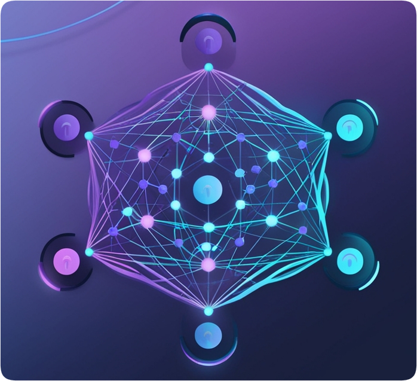

# DigitRecognition

  

## Описание
Десктопное приложение на Kotlin, разработанное с использованием Compose Multiplatform и библиотеки KotlinDL.
Приложение позволяет пользователю рисовать цифры от 0 до 9, и нейросеть, обученная на наборе данных MNIST, автоматически распознает нарисованную цифру.

**Особенности приложения**

* **Распознавание цифр:** приложение использует модель нейросети, которая была обучена на наборе данных MNIST, для распознавания рукописных цифр.

* **Интерактивный интерфейс:** пользователь может нарисовать цифру на холсте, и приложение подсветит соответствующую цифру зелёным цветом, указывая на результат распознавания.

* **Кроссплатформенность:** Благодаря Compose Multiplatform, его можно запускать на Windows, macOS и Linux.

**Использование**
1. Запустите приложение.
2. Используя мышь, нарисуйте цифру на холсте.
3. Нейросеть распознает вашу цифру и соответствующая кнопка над холстом станет зелёной.
4. Чтобы очистить холст, нажмите кнопку «Очистить».

https://github.com/user-attachments/assets/1914af64-9efd-42f2-b0cd-5b79ebb40ac7
